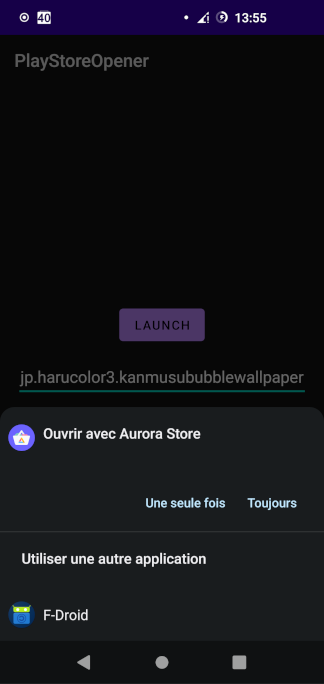

# Google Store Opener

Cette petite application permet juste de lancer l'application installée qui gère les liens du Play Store en passant le nom d'un package. L'application ouverte peut etre Gogle Play ou bien AuroraStore, F-Droid, ... Bref toutes les application qui sont capable d'ouvrir le protocole de Google Play Store.

## Pourquoi avoir créer ça ?

Aurora Store n'a (jusqu’à aujourd’hui) pas la possibilité de rechercher une application Android par son nom de package.
En effet quand on cherche par exemple à installer des applications en Japonais, il est parfois plus simple de copier le nom du paquet qui sera toujours écrit en lettres latines.

## A quoi ça ressemble ?

L'application est on ne peut plus simple:

- Une zone de texte pour saisir le nom du paquet
- Un boutton Launch qui sert à lancer l'action de recherche

 